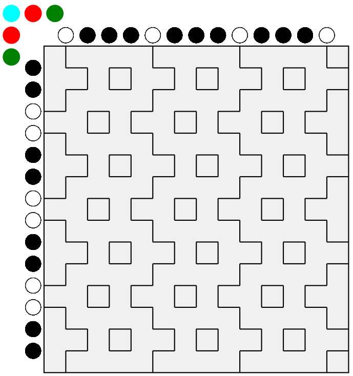

# Hitomezashi Stitch Patterns
Web app to investigate hitomezashi stitch patterns. This branch has a static version to serve on github.io.

This is inspired by the Numberphile video https://www.youtube.com/watch?v=JbfhzlMk2eY

To run the app,

1. clone the repo, enter base directory of repository
1. The usual `pip install -r requirements.txt`
1. Run `sh run.sh` in a shell
1. Open `project/static-app/index.html` in a browser. 

This is a screenshot of the app.

