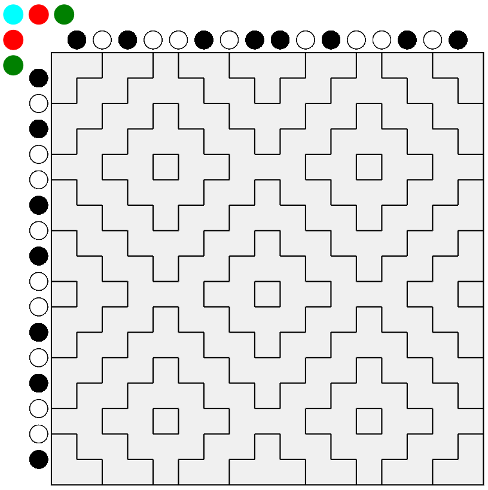

# Hitomezashi Stitch Patterns
Web app to investigate hitomezashi stitch patterns.

This is inspired by the Numberphile video https://www.youtube.com/watch?v=JbfhzlMk2eY

To run the app, clone the repo, then run `sh run.sh` in a shell. Connect to `localhost:5000`.

This is a screenshot of the app.

